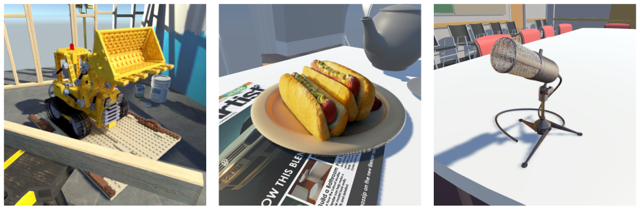

# Real-Time Rendering of Neural Radiance Fields (Work-in-Progress)

We propose an approach to rendering Neural Radiance Fields ([NeRFs](https://www.matthewtancik.com/nerf)) in real-time using a hybrid rendering pipeline developed as an extension to an existing, fully-featured rasterizing renderer.
Notably, this enables our method to render scenes containing a combination of NeRF and mesh-based assets.
We base our method on the approach of [PlenOctrees](https://alexyu.net/plenoctrees/) by Yu et al. in which the results of the NeRF network are cached using a sparse voxel octree (SVO) structure which can be efficiently queried using GPU acceleration.
We also provide an implementation based on the Unity's forward rendering pipeline.

## Method

Our method bridges the gap between the triangle mesh representation traditionally used in the rasterization of 3D assets and the volumetric nature of NeRFs by representing NeRFs using convex hulls.
<!--- Our method represents NeRF content within a scene volumetrically using 3D hulls. -->
We render NeRFs via a ray-marching procedure implemented using programmable pixel shaders:
For each camera ray intersecting the NeRF's hull, we sample the SVO iteratively along the path of the ray using custom vertex and fragment shaders.
The resulting radiance, transmittance, and depth are then used to produce the final image.

## Results

Our method is capable of rendering NeRFs in real time as part of complex scenes along with mesh-based 3D assets while achieving performance that is comparable to state-of-the-art methods.
We do this using widely supported graphics hardware functionality (and without relying on vendor-specific features) by basing our method on portable, well-established rendering techniques.
We hope this is a step in making NeRFs more accessible to a larger audience by enabling their adoption in contexts where this was previously not practical.

**Figure:** Qualitative results of our method using a relatively small cache size of $256^3$.
Background environments for each sample scene were built using textured 3D meshes.

## Benchmarks

| Method         | GPU         | Baseline |    FPS | Speedup |
| :------------- | :---------- | -------: | -----: | ------: |
| FastNeRF       | RTX 3090    |    0.06  | 172.4  |    2873 | <!--- 35.58 TFLOPS -->
| KiloNeRF       | GTX 1080Ti  |    0.018 |  38.46 |    2137 | <!--- 11.34 TFLOPS -->
| PlenOctrees    | Tesla V100  |    0.023 | 167.68 |    7290 | <!--- 14.13 TFLOPS -->
| SNeRF          | MacBook Pro |    0.03  |  84.06 |    2802 | <!---  5.30 TFLOPS -->
| **Our Method** | RX 6700 XT  |      N/A | 174.9  |     N/A | <!--- 13.21 TFLOPS -->

**Table:** Column "baseline" represents the frame rate for the vanilla NeRF model using the specified hardware.
Results measured using the NeRF synthetic dataset at a resolution of $800 \times 800$.
Preliminary results for our method were measured using the Unity Editor’s preview mode.
The baseline for our hardware was omitted since a fair comparison with NeRF would require Nvidia hardware for GPU acceleration support.

<!---
## Documentation

- [Rendering Model](Docs/Rendering-Model.md)
- [The N3Tree Structure](Docs/N3Tree-Structure.md)
- [The SparseVoxelOctree Structure](Docs/SparseVoxelOctree-Structure.md)
- [Comparison of Real-Time NeRF Models](Docs/Comparison-of-Real-Time-NeRF-Models.md)
- [Comparison of Serialization Formats](Docs/Comparison-of-Serialization-Formats.md)
-->