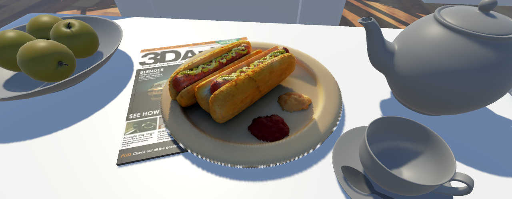

# Unity NeRF

$$
\begin{aligned}
  & \phi(x,y) = \phi \left(\sum_{i=1}^n x_ie_i, \sum_{j=1}^n y_je_j \right)
  = \sum_{i=1}^n \sum_{j=1}^n x_i y_j \phi(e_i, e_j) = \\
  & (x_1, \ldots, x_n) \left( \begin{array}{ccc}
      \phi(e_1, e_1) & \cdots & \phi(e_1, e_n) \\
      \vdots & \ddots & \vdots \\
      \phi(e_n, e_1) & \cdots & \phi(e_n, e_n)
    \end{array} \right)
  \left( \begin{array}{c}
      y_1 \\
      \vdots \\
      y_n
    \end{array} \right)
\end{aligned}
$$

This project aims to implement real-time rendering of [NeRF](https://www.matthewtancik.com/nerf) scenes inside Unity. It is based on the method developed by [Yu et al.](https://alexyu.net/plenoctrees/) and works by caching the results of the NeRF network using a sparse voxel octree (SVO) structure with GPU acceleration.

**Note:** Due to GitHub's file size limits, some of the files required to run the example scenes included in this project are not tracked as part of this repo. These can be found in the "releases" section as downloads.

## Documentation

- [Rendering Model](Docs/Rendering-Model.md)
- [The N3Tree Structure](Docs/N3Tree-Structure.md)
- [The SparseVoxelOctree Structure](Docs/SparseVoxelOctree-Structure.md)
- [Comparison of Real-Time NeRF Models](Docs/Comparison-of-Real-Time-NeRF-Models.md)
- [Comparison of Serialization Formats](Docs/Comparison-of-Serialization-Formats.md)

## Requirements

Unity 2021.1.23f1
